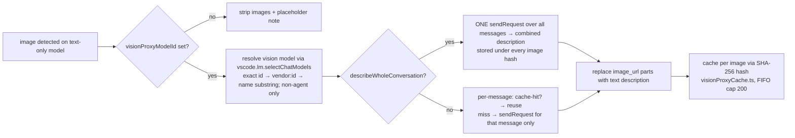

**Status:** 🟢 Active

# Architecture Map

**Topic:** architecture / provider / streaming / routing / usage / models / thinking
**Updated:** 2026-08-15
**Tags:** #architecture #provider #streaming #routing #usage #models #thinking #byok #autocomplete
**Supersedes:** -
**Related:** `docs/architecture/01-20260514-open-code-provider-architecture.md` · `docs/architecture/02-20260809-provider-adapter-architecture.md`

---

## Overview

This is the **navigation map** for the `everything-copilot-chat` codebase — a fork of `opencode-copilot-chat` with added **Volcengine Ark** and **Qianwen AI** providers. It answers, in one place:

- Which domain owns which folder / file (and how big each is).
- How modules depend on each other (so you never touch module A without checking module B).
- Which shared libraries to reuse before writing new logic.
- The data-driven model registry (the single table that routes model families to transports + thinking).
- The core execution flows (activation → model discovery → chat request → streaming).
- The auxiliary subsystems: vision proxy, context-window hook, usage accounting (server + CLI + tracked), inline autocomplete.
- The hot spots / remaining god files and the anti-regression contracts.
- The tests, tooling and CI surface.

This is a **living reference** — update it in the same session whenever a module, file, or dependency changes.

> **History context:** the codebase was a flat file tree with three god files (`extension.ts` 4,653 lines, `streaming.ts` 1,686, `goUsageTracker.ts` 1,510). The adapter refactor (executed 2026-08-14, see `02-20260809-provider-adapter-architecture.md`) split them into the domain folders below and added the data-driven registry. The map reflects the **current** structure.

---

## 1. Domain Ownership Map

Total `src/` ≈ **16,310 lines** across ~109 files (excl. tests). Grouped by domain (folders) then root-level utilities.

| Domain                      | Folder / Files                                                                                                                                                                                                                                                                                                                                                                                                                                                                                                           | LoC    | Owns                                                                                                                                                                                                                                                                                                                                                                                                              | Key contracts                                                                                                                                                                              |
| --------------------------- | ------------------------------------------------------------------------------------------------------------------------------------------------------------------------------------------------------------------------------------------------------------------------------------------------------------------------------------------------------------------------------------------------------------------------------------------------------------------------------------------------------------------------ | ------ | ----------------------------------------------------------------------------------------------------------------------------------------------------------------------------------------------------------------------------------------------------------------------------------------------------------------------------------------------------------------------------------------------------------------- | ------------------------------------------------------------------------------------------------------------------------------------------------------------------------------------------ |
| **Provider**                | `src/provider/` — `OpenCodeProvider.ts` (532), `chatPrep.ts` (332), `messages.ts` (430), `modelInfo.ts` (239), `historyTrim.ts` (200), `settings.ts` (260), `modelList.ts` (185), `visionProxy.ts` (345), `providerDialogs.ts` (118), `transportLog.ts` (109), `definitions.ts` (238), `tokens.ts` (106), `providerUtils.ts` (35)                                                                                                                                                                                        | ~3,009 | The `OpenCodeProvider` class implementing `LanguageModelChatProvider` (thin — delegates to siblings via deps objects), request preparation (`chatPrep`: message conversion, vision proxy, history trimming, budgets, thinking payload), model-info assembly (`modelInfo`), model-list fetch/cache (`modelList`), Manage/Test-Connection flows (`providerDialogs`), rolling transport diagnostics (`transportLog`) | `prepareChatRequest()` / `provideModelChatInformation()` / `convertMessage()` / `normalizeMessages()` / `trimOldMessagesToFitContext()` / `historyByteCapForBudget()` / `ModelListFetcher` |
| **Transports**              | `src/transports/` — `engine.ts` (409), `extractors.ts` (556), `extract.ts` (225), `thinkTags.ts` (139), `streamParts.ts` (88), `sse.ts` (31), `chatCompletions.ts` (64), `responses.ts` (30), `anthropic.ts` (28), `google.ts` (31)                                                                                                                                                                                                                                                                                      | ~1,601 | One adapter per wire format (OpenAI chat-completions, OpenAI Responses, Anthropic Messages, Google generateContent) + the shared streaming engine, SSE parser, response extractors                                                                                                                                                                                                                                | `streamOpenCodeResponse()` (engine), `OpenAiResponseExtractor` / `AnthropicResponseExtractor`                                                                                              |
| **Core (registry/routing)** | `src/core/` — `routing.ts` (441), `registry.ts` (142), `transport.ts` (70)                                                                                                                                                                                                                                                                                                                                                                                                                                               | ~653   | Data-driven model registry (`MODEL_REGISTRY`), transport resolution (`resolveModelRouting`), Responses/Google SSE normalization, shared `StreamRequestOptions` contract                                                                                                                                                                                                                                           | **Pure** — no `vscode` import, no side effects                                                                                                                                             |
| **Models (metadata)**       | `src/models/` — `metadata.ts` (523), `modelTables.ts` (141), `metadataFetcher.ts` (102), `modelLimits.ts` (52), `modelCapabilities.ts` (16), `modelNames.ts` (29), `pricing.ts` (88)                                                                                                                                                                                                                                                                                                                                     | ~951   | models.dev live metadata + bundled fallback snapshot (static data tables in `modelTables.ts`), limit/capability resolution, pricing                                                                                                                                                                                                                                                                               | Live fetch may fail → bundled snapshot MUST exist                                                                                                                                          |
| **Usage**                   | `src/usage/` — `tracker.ts` (585, thin class shell), `trackerTypes.ts` (96), `trackerWindows.ts` (140), `trackerSummary.ts` (238), `dashboard.ts` (19 barrel) + `dashboard/` (`webview.ts`, `webviewData.ts`, `webviewHtml.ts`, `state.ts`, `statusBar.ts`, `targetEditor.ts`, `tooltip.ts` ≈ 1,405), `history.ts` (378), `usage.ts` (146), `goUsageSync.ts` (128), `formatting.ts` (129), `usageProfile.ts` (74), `pricing.ts` (62)                                                                                     | ~3,571 | Go usage tracker (types/windows/summary split out of the old god file), per-profile tracking, CLI SQLite history reader, server-usage sync, status bar + usage webview + quick-pick (webview split into state/status/webview modules)                                                                                                                                                                             | Server meters authoritative for Session/Weekly/Monthly; device-local for Today/Yesterday                                                                                                   |
| **Thinking**                | `src/thinking/` — `provider.ts` (78), `base.ts` (75), `resolve.ts` (66), `deepseek.ts` (53), `glm.ts` (53), `kimi.ts` (81), `minimax.ts` (54), `mimo.ts` (72), `openai.ts` (57), `qwen.ts` (103), `fallback.ts` (39), `schema.ts` (106), `payload.ts` (26), `types.ts` (51)                                                                                                                                                                                                                                              | ~914   | Per-family thinking strategy classes + config resolution (single authority = per-model config)                                                                                                                                                                                                                                                                                                                    | **Pure** — no `vscode` import; family from registry                                                                                                                                        |
| **Request builders**        | `src/request/` — `anthropic.ts` (233), `google.ts` (176), `types.ts` (117), `schema.ts` (94), `openai.ts` (95), `headers.ts` (110), `builders.ts` (17), `shared.ts` (11)                                                                                                                                                                                                                                                                                                                                                 | ~853   | Per-endpoint request-body builders + shared header builders (`x-opencode-session` / `x-opencode-request`)                                                                                                                                                                                                                                                                                                         | `builders.ts` is the public barrel                                                                                                                                                         |
| **Commands**                | `src/commands/` — `agentsWindow.ts` (130), `diagnostics.ts` (41), `providers.ts` (38), `thinkingPicker.ts` (31)                                                                                                                                                                                                                                                                                                                                                                                                          | ~240   | Command handlers: diagnostics, agents-window BYOK bridge, provider enable/disable, thinking picker                                                                                                                                                                                                                                                                                                                | Thin — delegates to provider/usage modules                                                                                                                                                 |
| **Autocomplete**            | `src/autocomplete/` — `index.ts` (157), `engine.ts` (143), `provider.ts` (127), `context.ts` (89), `usage.ts` (88), `throttle.ts` (79), `prompt.ts` (60), `types.ts` (32)                                                                                                                                                                                                                                                                                                                                                | ~775   | Inline code suggestions (opt-in) — FIM emulation over chat-completions, debounce/throttle, usage counters                                                                                                                                                                                                                                                                                                         | Separate subsystem; not wired into Go cost tracker yet                                                                                                                                     |
| **Extension entry**         | `src/extension.ts`                                                                                                                                                                                                                                                                                                                                                                                                                                                                                                       | 415    | Thin `activate()`/`deactivate()` — wiring only (command registration, provider registration, status bar init)                                                                                                                                                                                                                                                                                                     | Target <300 lines; keep wiring-only                                                                                                                                                        |
| **Root utilities**          | `src/config.ts` (278), `contextWindowHook.ts` (485), `contextWindowHookBridge.ts` (122), `errors.ts` (294), `retry.ts` (255), `utils.ts` (186), `responsesRequest.ts` (180), `toolCallAccumulator.ts` (138), `imageNormalizer.ts` (118), `visionProxyCache.ts` (79), `runtimeDiagnostics.ts` (57), `chatParts.ts` (55), `reasoningHistory.ts` (43), `tokenEstimate.ts` (39), `providerTypes.ts` (23), `openCodeAuth.ts` (20), `providerEnablement.ts` (18), `apiKeyResolution.ts` (8), `thinking.ts` (30, legacy barrel) | ~2,428 | Cross-cutting utilities (plus the two proposed-API `.d.ts` module augmentations ≈ 231 LoC — `chatProvider` v6 + `languageModelThinkingPart` v1)                                                                                                                                                                                                                                                                   | `config.ts` must stay **dependency-free**                                                                                                                                                  |

---

## 2. Module Context Loading Protocol

> The provider domain and the transports/core domains are the two most-interconnected areas. Before a non-trivial task, load only the relevant context below.

### Step 1 — Identify Domain

Map the task to a domain from Section 1. Ask: does it touch a _wire-format_, _model metadata_, _routing_, _usage accounting_, _message conversion_, or _UI_?

### Step 2 — Load Module Context

1. Read the owning module's header block (`CONTRACT` / `RULES` / `INVARIANTS`) — present in the pure/sensitive modules.
2. For a new model family: read `src/core/registry.ts` (add ONE row) + optionally a thinking class in `src/thinking/`.
3. For a streaming change: read `src/transports/engine.ts` + the relevant adapter + `extractors.ts`.
4. For a usage change: read `src/usage/tracker.ts` (class shell) + the relevant split module (`trackerTypes` / `trackerWindows` / `trackerSummary` / `dashboard*`).

### Step 3 — Check Cross-Module Dependencies

See the dependency graph in Section 3. The heaviest fan-in is the provider domain — `OpenCodeProvider.ts` delegates to `chatPrep` / `modelInfo` / `modelList` / `providerDialogs` / `transportLog`; any change to a module in that fan-out must be checked against its deps-object contract.

### Step 4 — Shared Lib Lookup

Before writing new logic, check Section 6 — reuse `config.ts`, `utils.ts`, `errors.ts`, `retry.ts`, `chatParts.ts` instead of reinventing.

---

## 3. Module Dependency Graph

```mermaid
flowchart TD
    EXT[extension.ts<br/>thin wiring]

    subgraph Provider
        PRV[OpenCodeProvider.ts<br/>thin class]
        CPREP[chatPrep.ts<br/>request preparation]
        MINFO[modelInfo.ts<br/>model assembly]
        MLIST[modelList.ts<br/>fetch + cache]
        DLG[providerDialogs.ts<br/>manage/test flows]
        TLOG[transportLog.ts<br/>rolling diagnostics]
        DEF[definitions.ts<br/>PROVIDERS table]
        MSG[messages.ts<br/>convertMessage]
        HTRIM[historyTrim.ts<br/>byte-capped trim]
        SET[settings.ts<br/>limits/schema]
        VP[visionProxy.ts]
        TOK[tokens.ts]
    end

    subgraph Core
        REG[core/registry.ts<br/>MODEL_REGISTRY]
        ROU[core/routing.ts<br/>resolveModelRouting]
        TR[core/transport.ts<br/>StreamRequestOptions]
    end

    subgraph Transports
        ENG[transports/engine.ts]
        TC[chatCompletions.ts]
        RS[responses.ts]
        AN[anthropic.ts]
        GO[google.ts]
        XTR[extractors.ts]
    end

    subgraph Models
        MD[models/metadata.ts]
        MF[models/metadataFetcher.ts]
        ML[models/modelLimits.ts]
        PR[models/pricing.ts]
    end

    subgraph Thinking
        TH[thinking/provider.ts]
        TRS[thinking/resolve.ts]
        TF[thinking/*.ts per family]
    end

    subgraph Usage
        TRK[usage/tracker.ts<br/>class shell]
        TTYP[trackerTypes.ts]
        TWIN[trackerWindows.ts]
        TSUM[trackerSummary.ts]
        DSH[dashboard barrel +<br/>dashboard/* modules]
        GOS[usage/goUsageSync.ts]
        HST[usage/history.ts]
    end

    subgraph Request
        RB[request/builders.ts barrel]
        HDR[request/headers.ts]
        OAU[openCodeAuth.ts]
    end

    subgraph Commands
        CM[commands/*]
    end

    EXT --> PRV
    EXT --> DEF
    EXT --> DSH
    EXT --> CM
    EXT --> MF
    EXT --> VP

    PRV --> DEF
    PRV --> ROU
    PRV --> TH
    PRV --> TRS
    PRV --> MD
    PRV --> ML
    PRV --> MSG
    PRV --> SET
    PRV --> VP
    PRV --> RB
    PRV --> HDR
    PRV --> TC & RS & AN & GO
    PRV --> TRK
    PRV --> DSH
    PRV --> GOS
    PRV --> PR
    PRV --> TOK

    PRV --> CPREP
    PRV --> MINFO
    PRV --> MLIST
    PRV --> DLG
    PRV --> TLOG
    CPREP --> MSG
    CPREP --> HTRIM
    CPREP --> SET
    CPREP --> VP
    MINFO --> SET
    MLIST --> MF

    ROU --> REG
    TH --> REG
    TRS --> TH
    TH --> TF

    TC --> ENG
    RS --> ENG
    AN --> ENG
    GO --> ENG
    ENG --> TR
    ENG --> XTR
    TC --> XTR
    RS --> ROU
    GO --> ROU

    MF --> MD
    SET --> ML
    SET --> MD
    PRV --> MF
    TRK --> MD

    TRK --> GOS
    TRK --> HST
    DSH --> TRK
    DSH --> HST
    DSH --> MF

    RB --> HDR
    RB --> OAU
    ENG --> OAU
```

### Key edges & blast-radius notes

| Edge                                                          | Why it matters                                                                                                                                                    |
| ------------------------------------------------------------- | ----------------------------------------------------------------------------------------------------------------------------------------------------------------- |
| `OpenCodeProvider` → `transports/*` + `core/routing`          | Changing a transport adapter or the registry can break the provider's request path. **Always `npm run compile` + test ≥1 model family of the touched transport.** |
| `thinking/provider` + `core/routing` → `core/registry`        | The registry is the **single source of truth** for both transport AND thinking family. Never hardcode a family decision elsewhere.                                |
| `transports/*` → `core/transport.ts`                          | `StreamRequestOptions` is the shared contract — changing it touches every adapter.                                                                                |
| `usage/dashboard` → `tracker` + `history` + `metadataFetcher` | The dashboard is the hub for all usage UI; it pulls from tracker (server+tracked), history (CLI SQLite), and metadata (cost).                                     |
| `OpenCodeProvider` → `usage/*`                                | Every Go request records usage via `onTransportSummary` → `tracker.record()`. Breaking this silently stops usage accounting.                                      |

---

## 4. Data-Driven Model Registry

`src/core/registry.ts` — the single table that decides **transport** + **thinking family** for a model id. Adding a model family = adding ONE row (optionally + a thinking class). Evaluated **in table order, first match wins** (specific patterns before generic ones).

| Family        | Pattern                                                   | endpointKind       | thinkingFamily | Vendor restriction                         |
| ------------- | --------------------------------------------------------- | ------------------ | -------------- | ------------------------------------------ |
| GPT           | `/^gpt-/i`                                                | `responses`        | `openai`       | any                                        |
| Claude        | `/^claude-/i`                                             | `messages`         | `null`         | any                                        |
| MiniMax m2.x  | `/^minimax-m2\./i`                                        | `messages`         | `minimax`      | `opencodego` only (Zen → chat-completions) |
| Qwen Messages | `/^qwen3\.(?:5\|6)-plus(?:-free)?$/` · `/^qwen3\.7-max$/` | `messages`         | `qwen`         | any                                        |
| Gemini        | `/^gemini-/i`                                             | `google`           | `null`         | `opencodezen` only                         |
| MiniMax       | `/^minimax-/i`                                            | `chat-completions` | `minimax`      | any                                        |
| DeepSeek      | `/^deepseek-/i`                                           | `chat-completions` | `deepseek`     | any                                        |
| GLM           | `/^glm-/i`                                                | `chat-completions` | `glm`          | any                                        |
| Kimi          | `/^kimi-/i`                                               | `chat-completions` | `kimi`         | any                                        |
| MiMo          | `/^mimo-/i`                                               | `chat-completions` | `mimo`         | any                                        |
| Qwen          | `/^qwen3(?:\.\|-)/i`                                      | `chat-completions` | `qwen`         | any                                        |
| **default**   | `/.*/`                                                    | `chat-completions` | `null`         | any (catch-all)                            |

> **Scope note:** context limits / capabilities / cost are **NOT** in this table — they stay metadata-driven (live models.dev via `src/models/metadata.ts`). Do not duplicate them into a static table.

**Endpoint URL resolution** (`resolveModelRouting`): agent-host variants resolve to their base vendor first; `responses` → `provider.responsesUrl`, `messages` → `provider.messagesUrl`, `google` → `${provider.modelsUrl}/${modelId}`, default → `provider.chatCompletionsUrl`.

---

## 5. Core Execution Flows

### 5.1 Activation (`extension.ts`)

```mermaid
flowchart LR
    A[activate] --> B[create GoUsageTracker + output channel]
    A --> C[load profiles / active profile fingerprint]
    A --> D[ensure status bars]
    A --> E[sync server usage once (TTL-guarded)]
    A --> F[new OpenCodeProvider for GO + ZEN]
    A --> G[register languageModelChatProviders<br/>gated by opencodego.enabled / opencodezen.enabled]
    A --> H[register 16 commands]
    A --> I[optional agent-host providers + BYOK bridge]
    A --> J[config-change listener]
    A --> K[startUsageRefreshLoop]
    A --> L[warmModelPickerMetadata]
    A --> M[registerInlineCompletions]
```

### 5.2 Model Discovery (`provideLanguageModelChatInformation`)

1. **Key resolution**: BYOK `options.configuration.apiKey` → (if BYOK group observed, return `[]` to avoid duplicates, issue #106/#131) → `SecretStorage` fallback.
2. Persist key to SecretStorage (non-agent variants) so agent variants inherit it.
3. `fetchModels()` — live GET `modelsUrl` with retry/backoff/timeout (issue #78) → `filterAvailableModels()` (drops `KNOWN_UNAVAILABLE_MODEL_IDS`, deprecated Zen models cross-checked against gateway response (issue #182), `freeOnly` filter).
4. Per model: `resolveModelMetadata()` → `resolveModelRouting()` → `modelLimits()` → `modelCapabilities()` → `modelConfigurationSchema()` (thinking submenu + context-size tier) → build `OpenCodeModel` (general variant or `::agent-host` variant with `targetChatSessionType: "copilotcli"`).

### 5.3 Chat Request (`provideLanguageModelChatResponse`)

```mermaid
flowchart TD
    A[resolve apiKey: BYOK config → per-model cache → SecretStorage cold-start] --> B[convertMessage per message<br/>tool calls / tool results / images / thinking echo]
    B --> C[flatten messages + source index]
    C --> D[resolve thinking config<br/>per-model config = single authority]
    D --> E[vision proxy: text-only model + images → relay to vision model]
    E --> F[normalizeMessages + trimOldImagesFromHistoryInPlace<br/>keep MAX_HISTORY_IMAGES_KEPT=2]
    F --> G[estimatePromptTokenCount → modelLimits]
    G --> H[thinkingProviderFor().buildPayload]
    H --> I[route by registry: chat-completions | responses | messages | google]
    I --> J[build request body + headers<br/>x-opencode-session / x-opencode-request]
    J --> K[streamOpenCodeResponse]
    K --> L[SSE parse → extractors → emit parts<br/>text / thinking / tool-call / usage DataPart]
    K --> M[onTransportSummary → tracker.record + status bar + server sync + copilotCredits]
```

### 5.4 Streaming Engine (`transports/engine.ts`)

Single engine, four adapters. Handles: HTTP 400 recoverable retry (`analyzeHttp400ForRetry`), transient 5xx backoff, request/idle timeouts, cancellation, usage summary + context-window report + usage DataParts. **No gzip** (OpenCode proxy returns 500 on `Content-Encoding: gzip`).

Extractors: `OpenAiResponseExtractor` (chat-completions + normalized Responses/Google) and `AnthropicResponseExtractor` (Messages SSE event types), sharing `BaseResponseExtractor` (reasoning accounting + think-tag filter + loop suppression).

### 5.5 Vision Proxy (`provider/visionProxy.ts`)

For a text-only model receiving images (`hasImageInput && !actuallySupportsVision`):



**Image description cache** (`src/visionProxyCache.ts`): key = SHA-256 of the image's base64 bytes; a combined multi-image description is stored under every hash; FIFO eviction at 200 entries. Once described, later turns never re-call the vision model.

### 5.6 Context-Window Hook (`contextWindowHook.ts` + `bridge`)

Not a plain API hook — it **monkey-patches Copilot Chat internals** to inject per-request usage metadata (prompt/completion tokens + output buffer) into VS Code's own request tracking, so the context-window indicator is accurate:

- `initializeContextWindowHook()` (lazy-loaded via `contextWindowHookBridge.ts`):
  1. **Capture**: temporarily patches `Map.prototype.set` and creates a probe `ChatParticipant` to find Copilot's internal progress proxy object (`$handleProgressChunk`), then restores the Map.
  2. **Patch**: replaces `$handleProgressChunk` with a wrapper that injects `{ kind: "usage", promptTokens, completionTokens, outputBuffer }` chunks, and rewires `Set.prototype.add/delete` to track in-flight request IDs (`extRequest` entries) for request↔local-ID correlation.
  3. **Route**: maps VS Code request IDs ↔ the provider's local `x-opencode-request` IDs via `AsyncLocalStorage`; `reportUsageToContextWindowForRequest()` / `setContextWindowOutputBufferForRequest()` / `reportProgressWithContextWindowRequest()` are called from `transports/engine.ts` and the provider.
- `disposeContextWindowHook()` restores every patched method. If capture fails (Copilot internals changed), it **silently no-ops** — never crashes.

### 5.7 Usage Accounting — Three Sources, One Summary

`GoUsageTracker.getSummary()` merges three independent sources (see `src/usage/`):

| Source                        | Module                      | What it provides                                                                                                                                              | Authority                                      |
| ----------------------------- | --------------------------- | ------------------------------------------------------------------------------------------------------------------------------------------------------------- | ---------------------------------------------- |
| **Server meters**             | `goUsageSync.ts`            | Account-wide `rolling` / `weekly` / `monthly` percent + resetsAt from `GET /zen/go/v1/usage` (60s TTL; `spent = limit × percent`)                             | Session/Weekly/Monthly meters                  |
| **CLI SQLite history**        | `history.ts`                | Reads `~/.local/share/opencode/opencode.db` (`node:sqlite` first, then `sqlite3` binary incl. Android SDK; 3s memoization); per-message cost/tokens/cwd/model | Today / Yesterday / Codebase rows              |
| **Extension-tracked entries** | `tracker.ts` + `pricing.ts` | `record()` per Go request → `UsageLogEntry` (cost via `estimateCost` + resolved metadata)                                                                     | Fallback when CLI DB absent; per-session costs |

**Per-profile accounting** (`usageProfile.ts`): profiles keyed by fingerprint (first 8 + last 8 chars of the API key); each profile owns namespaced globalState storage; manual spent targets (with monthly billing anchor) become baselines. The singleton legacy tracker migrates into profiles once. Server meters always overlay the local summary and never report "no data" when a snapshot exists.

---

## 6. Shared Libraries & Utilities

Reuse these before writing new logic (all under `src/` root unless noted):

| Lib                      | Purpose                                                                                                                                                                 | Import from          |
| ------------------------ | ----------------------------------------------------------------------------------------------------------------------------------------------------------------------- | -------------------- |
| `config.ts`              | **All** tunables: URLs, timeouts, limits, storage keys, setting keys, defaults. Dependency-free.                                                                        | anywhere             |
| `utils.ts`               | `isRecord`, `firstString`, `getErrorMessage`, `formatUsd`, `formatTokenCount`, `formatCount`, `formatRelativeTime`, `escapeHtml`, `sleep*`                              | anywhere             |
| `errors.ts`              | `OpenCodeRequestError` taxonomy + `buildOpenCodeRequestError` (rate-limit / Router.Unavailable hints)                                                                   | all request paths    |
| `retry.ts`               | `analyzeHttp400ForRetry`, `isTransientServerError`, transient-5xx constants                                                                                             | engine + fetch       |
| `chatParts.ts`           | `createUsageDataParts`, reasoning marker parts                                                                                                                          | engine / extractors  |
| `tokenEstimate.ts`       | `estimateTokenCount`, `estimatePromptTokenCount`                                                                                                                        | provider             |
| `imageNormalizer.ts`     | normalize image data-URLs to provider-safe dims/encoding                                                                                                                | messages + vision    |
| `openCodeAuth.ts`        | `buildOpenCodeGatewayAuthHeaders` (Bearer / x-api-key / x-goog-api-key)                                                                                                 | provider             |
| `apiKeyResolution.ts`    | `resolveResponseApiKey` cold-start fallback                                                                                                                             | provider             |
| `providerEnablement.ts`  | `providerEnabledSetting()` — reads root config (never section-scoped)                                                                                                   | extension + commands |
| `reasoningHistory.ts`    | `thinkingTextFromValue`, `shouldEchoThinkingHistory` (family-gated echo)                                                                                                | messages             |
| `toolCallAccumulator.ts` | `ToolCallAccumulator` (flush only on `tool_calls` finish reason)                                                                                                        | extractors           |
| `contextWindowHook*.ts`  | context-window usage injection — **monkey-patches** Copilot's internal `$handleProgressChunk` + `Set.prototype`; bridge = lazy-load seam; silent no-op if capture fails | engine/provider      |
| `visionProxyCache.ts`    | SHA-256 image-hash → vision-proxy description cache (FIFO, cap 200)                                                                                                     | provider             |
| `runtimeDiagnostics.ts`  | `runtimeDiagnosticsLines()` — version/host/platform/integrity lines for the Diagnostics command                                                                         | provider             |
| `request/headers.ts`     | `buildOpenCodeRequestHeaders` (sticky session/request id)                                                                                                               | provider             |
| `request/builders.ts`    | public barrel for body builders per endpoint                                                                                                                            | provider             |

---

## 7. Cross-Cutting Concerns & Anti-Regression Contracts

### Security

- **API keys only** via BYOK `options.configuration.apiKey` → SecretStorage mirror (`opencodego.apiKey` / `opencodezen.apiKey`). Never logged, never hardcoded, never in error messages.
- Keys only ever sent as an auth header (`Authorization` / `x-api-key` / `x-goog-api-key`).
- `reasoningContentByToolCallId` capped at 500 (per-call reasoning echo).

### Resilience

- **Live metadata may fail** → `bundledModelMetadataSnapshot()` + `fallbackModels` + persisted model-list cache (TTL 1h). Extension must keep working offline.
- Model-list fetch: 3 retries, 15s timeout, transient-error classification, cached snapshot over bundled.
- Chat request: 400 body-patch retry + transient 5xx backoff (2 retries), 10-min request timeout, 2-min stream idle timeout.
- Server usage sync: 60s TTL, fails back to SQLite→tracked estimates.

### Anti-regression checklist (new vendor/model)

1. Add ONE row to `core/registry.ts` (+ optional thinking class in `src/thinking/`).
2. Add metadata fallback in `models/metadata.ts` snapshot — **never remove the fallback**.
3. If a new wire format: add an adapter in `transports/` implementing the `StreamRequestOptions` contract; add a `request/builders.ts` entry.
4. Do **not** touch `extension.ts` for any of the above (wiring only).
5. Errors use `errors.ts` taxonomy (`OpenCodeRequestError`).
6. Verify: `npm run compile` pass + test ≥1 real model family of the touched transport.

### Known hot spots (next refactor candidates)

| File                                              | LoC | Note                                                                                                                                                                           |
| ------------------------------------------------- | --- | ------------------------------------------------------------------------------------------------------------------------------------------------------------------------------ |
| ~~`src/usage/dashboard.ts`~~ (resolved)           | —   | Split into `dashboard.ts` barrel + `dashboard/` modules (`webview`, `webviewData`, `webviewHtml`, `state`, `statusBar`, `targetEditor`, `tooltip`)                             |
| ~~`src/provider/OpenCodeProvider.ts`~~ (resolved) | —   | Class now 532 lines: request prep → `chatPrep.ts`, model info → `modelInfo.ts`, list fetch → `modelList.ts`, dialogs → `providerDialogs.ts`, transport log → `transportLog.ts` |
| ~~`src/usage/tracker.ts`~~ (resolved)             | —   | Class shell 585 lines; types/windows/summary extracted to `trackerTypes.ts` / `trackerWindows.ts` / `trackerSummary.ts`                                                        |
| `src/models/metadata.ts`                          | 523 | Snapshot normalization + limits helpers (static tables extracted to `modelTables.ts`)                                                                                          |
| `src/transports/extractors.ts`                    | 556 | Two extractor classes in one file — candidate: 1 file per extractor                                                                                                            |
| `src/contextWindowHook.ts`                        | 485 | Monkey-patches Copilot internals (`$handleProgressChunk` + `Set.prototype`) — high-risk to change (silent no-op on failure)                                                    |
| `src/core/routing.ts`                             | 441 | Mixes routing + Responses/Google normalizers — candidate: move normalizers to `transports/`                                                                                    |

> The full `ModelTransport` port interface (one adapter file per transport implementing a common `stream()` contract) remains **future work** per `02-20260809-provider-adapter-architecture.md` — the current adapters are thin wrappers over the shared `engine.ts`.

---

## 8. Tests, Tooling & CI

### Unit tests (`src/test/` — 22 files, 312 cases)

Pure/domain modules get co-located tests. **Harness:** Node's built-in `node --test` runner via `scripts/run-unit-tests.ts`, which collects the compiled `out/test/*.test.js` files; tests import from compiled `out/` modules with explicit `.js` extensions (Node16/ESM-style) and use `node:test` + `node:assert/strict`. Tests never need a live model — they cover the deterministic parts (message conversion, chunk parsing, token estimation, routing). Per-file case counts (312 total):

| Test file                     | Cases |     | Test file                   | Cases |
| ----------------------------- | ----- | --- | --------------------------- | ----- |
| `thinking.test.ts`            | 52    |     | `metadata.test.ts`          | 23    |
| `goUsageTracker.test.ts`      | 51    |     | `autocomplete.test.ts`      | 23    |
| `utils.test.ts`               | 20    |     | `retry.test.ts`             | 17    |
| `visionProxy.test.ts`         | 17    |     | `registry.test.ts`          | 14    |
| `toolCallAccumulator.test.ts` | 14    |     | `config.test.ts`            | 13    |
| `goUsageSync.test.ts`         | 9     |     | `autocompleteUsage.test.ts` | 9     |
| `usageProfile.test.ts`        | 9     |     | `reasoningHistory.test.ts`  | 9     |
| `responsesRequest.test.ts`    | 8     |     | `modelLimits.test.ts`       | 5     |
| `imageNormalizer.test.ts`     | 5     |     | `apiKeyResolution.test.ts`  | 3     |
| `chatParts.test.ts`           | 3     |     | `modelNames.test.ts`        | 3     |
| `providerEnablement.test.ts`  | 3     |     | `tokenEstimate.test.ts`     | 2     |

### Scripts (`scripts/`)

| Script                           | Purpose                                                                                                                                                             |
| -------------------------------- | ------------------------------------------------------------------------------------------------------------------------------------------------------------------- |
| `lint.ts` / `format.ts`          | Unified runners — Markdown (markdownlint-cli2 with `.markdownlint-cli2.json`) + Prettier + shellcheck + `tsc -p tsconfig.check.json`; `lint` ends with a Tests step |
| `staged-lint.ts`                 | Pre-commit gate: lints staged files **plus their direct import dependents** (real import graph) so a module change can't leave type-aware errors in consumers       |
| `run-unit-tests.ts`              | Runs the unit-test suite                                                                                                                                            |
| `test-retry-e2e.ts`              | Mock-server E2E for the retry/backoff path                                                                                                                          |
| `validate-models.ts`             | Validates model metadata against the live registry                                                                                                                  |
| `verify-estimate-token-count.ts` | Verifies the token estimator against production logic                                                                                                               |
| `probe-completion-latency.ts`    | Measures inline-completion engine latency live                                                                                                                      |
| `gitignore.ts`                   | Generates/updates `.gitignore`                                                                                                                                      |

### CI (`.github/workflows/ci.yml`)

On push/PR to `main`/`develop`, Node 20: `npm ci` → `compile` → `lint` (with `shellcheck` installed via apt into the runner temp) → `format:check` → `test` → `package` (VSIX dry-run) → upload VSIX artifact (14-day retention).

### Assets (`media/`)

`opencodego.png` / `opencodego.svg` — the extension icon.

### Toolchain

- **TS config:** `tsconfig.json` (strict, `module: Node16`, `target: ES2022`, `lib: [ES2022, DOM]`, `esModuleInterop`, `skipLibCheck`, `types: [node]`, includes `src/` only), `tsconfig.check.json` (`noEmit`, extends the build config, covers `src/` **+ `scripts/`** for the type-aware lint step), and `scripts/tsconfig.json` (`noEmit`, extends root, `rootDir: ..`, types `node`) for the script files.
- **ESLint** (`eslint.config.ts`, ESLint 10 flat config): `typescript-eslint` `strict` + `strictTypeChecked` (type-aware bug-catchers) — the pure-`stylistic` layer is deliberately off (prettier owns formatting). Plus `eslint-plugin-yml` and `eslint-plugin-jsonc`. Zero tolerance (`--max-warnings 0`).
- **Pre-commit gate** (`.husky/pre-commit`): resolves `npx` from nvm if PATH is stripped, then runs `scripts/staged-lint.ts` + `lint-staged` — check-mode only, never rewrites at commit time.
- **Proposed-API `.d.ts`:** `src/vscode.proposed.chatProvider.d.ts` (v6) and `src/vscode.proposed.languageModelThinkingPart.d.ts` (v1) are module augmentations of `declare module "vscode"` — no `enabledApiProposals` entry needed (activated via the `onLanguageModelChatProvider:*` activation events).
- **Runtime dependency:** only `@silvia-odwyer/photon-node` (image resizing for `imageNormalizer.ts`); everything else is dev tooling.

---

## 9. Version & Contribution Surface

- **Version:** `0.6.0` · **Engine:** `vscode ^1.125.0` · **Entry:** `./out/extension.js`
- **Activation:** `onStartupFinished`, `onLanguageModelChatProvider:opencodego`, `onLanguageModelChatProvider:opencodezen`
- **Contribution points:** `commands` (16), `configuration` (35+ keys), `languageModelChatProviders` (4 vendors: `opencodego`, `opencodezen`, `opencodego-agent`, `opencodezen-agent`)
- **4 providers:** Go (paid) + Zen (free default) + agent-host variants mirroring each base vendor
- **Endpoints:** `https://opencode.ai/zen/{go/,}v1/{models,chat/completions,messages,responses}` + `https://opencode.ai/zen/go/v1/usage` (server meters) + `https://models.dev/api.json` (metadata)

---

## 10. References

- `docs/architecture/01-20260514-open-code-provider-architecture.md` — provider/BYOK/usage history
- `docs/architecture/02-20260809-provider-adapter-architecture.md` — adapter architecture + migration plan
- `docs/features/16-20260813-usage-dashboard-realtime.md` — usage dashboard living reference
- `docs/features/17-20260814-data-driven-model-registry.md` — data-driven registry (user-maintained)
- `docs/issues/67-20260814-pr155-split-god-files-review-merge.md` — god-file split PR review (user-maintained)
- `docs/issues/` — issue-by-issue history (streaming, routing, thinking, usage, security)
- `CHANGELOG.md` — release notes (god-file split + registry landed in `[Unreleased]`)
