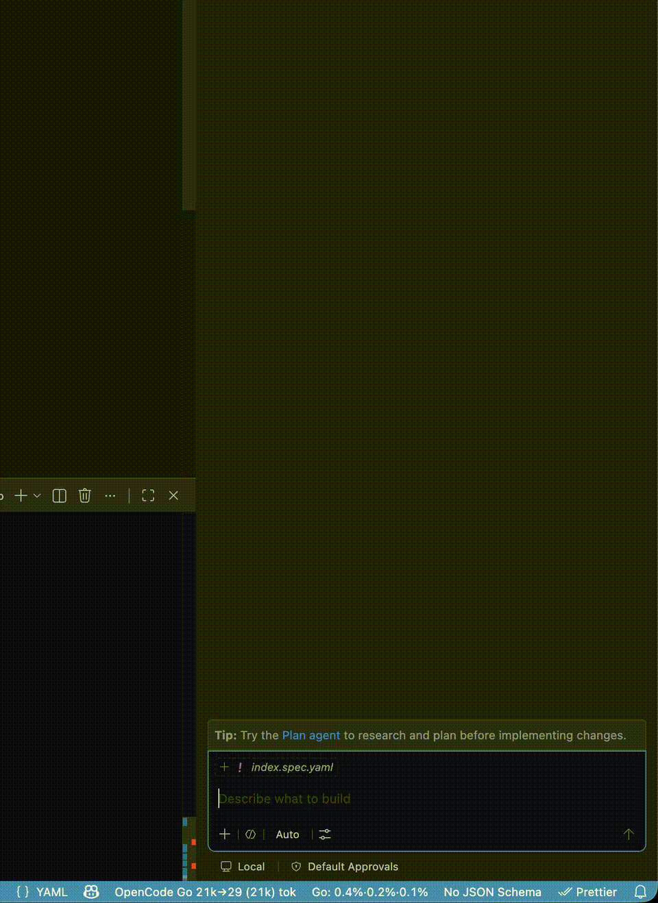
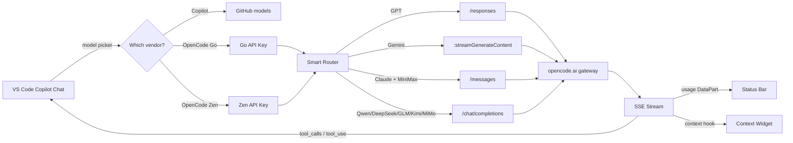

<div align="center">

# 🚀 Everything Copilot Chat

**Use 30+ frontier AI models** (DeepSeek V4, Kimi K3, GLM-5.2, GPT-5.6, Claude Opus 5, Gemini 3.6, Grok 4.5…) in GitHub Copilot Chat — **BYOK**

**Bring Your Own Key (BYOK)** · OpenCode Zen (free + paid models) or Go ($10/mo subscription) · Works with native Copilot Agent Mode

[](https://github.com/zphilip/everything-copilot-chat/actions/workflows/ci.yml)
[](https://marketplace.visualstudio.com/items?itemName=ltmoerdani.everything-copilot-chat)
[](https://github.com/zphilip/everything-copilot-chat/releases)
[](./LICENSE)
[](https://code.visualstudio.com/)
[](./CONTRIBUTING.md)
[](https://github.com/zphilip/everything-copilot-chat)

[**✨ Why you'll love it**](#-why-youll-love-it) · [**⚡ Quick Start (60 sec)**](#-quick-start-60-sec) · [**🧠 Models**](#-models) · [**📊 Compare**](#-github-copilot-vs-this-extension) · [**🔧 Settings**](#-settings) · [**❓ FAQ**](#-faq) · [**💬 Community**](#-community)

</div>

---

> **💡 The elevator pitch**
>
> **Copilot Chat is great — but its premium models cost $39/mo (Pro+), and the free tier is rate-limited.**
> This extension plugs **OpenCode's model gateway** into Copilot Chat's model picker. **OpenCode Zen** gives you rotating free models (Big Pickle is currently free; DeepSeek V4 Flash, MiMo-V2.5, and others rotate) plus paid models like Claude Opus, GPT-5.5, and Gemini at pay-as-you-go rates. **OpenCode Go** ($10/mo, $5 first month promo) gives you a curated set of open models (DeepSeek V4 Pro, Kimi K3, GLM-5.2, Qwen3.8 Max, MiMo V2.5 Pro) with generous usage limits. You keep the native Copilot UI, tool-calling, and Agent Mode — you just get **way more models**, often **cheaper than Copilot Pro+**.

> 🍴 **Fork of [opencode-copilot-chat](https://github.com/ltmoerdani/opencode-copilot-chat)** — the original OpenCode BYOK bridge — **plus two extra BYOK providers**: **Volcengine Ark** (coding plan, OpenAI-compatible) and **Qianwen AI** (Alibaba token-plan Qwen models, Anthropic- and OpenAI-compatible). OpenCode Go / Zen work exactly as upstream.

---

## 🔥 Why you'll love it

|                                  | What you get                                                                                                                                                                                                                                          |
| -------------------------------- | ----------------------------------------------------------------------------------------------------------------------------------------------------------------------------------------------------------------------------------------------------- |
| 💸 **Cheaper than Copilot Pro+** | VS Code + OpenCode **Zen free** models = **$0** for rotating free models (Big Pickle, DeepSeek V4 Flash, MiMo-V2.5, and others). Paid Zen models (Claude Opus, GPT-5.6) available at pay-as-you-go rates. Go subscription **$10/mo** ($5 first month) |
| 🌍 **30+ frontier models**       | DeepSeek V4, Kimi K3, GLM-5.2, Qwen3.8 Max, MiMo V2.5, MiniMax M3, Grok 4.5, Big Pickle — **all in one picker**                                                                                                                                       |
| 🤖 **Full Agent Mode**           | Tool-calling (read files, edit, run terminal) works natively — not just chat. Models also appear in the **Agents window** (Copilot CLI session)                                                                                                       |
| 🧠 **Thinking controls**         | Per-model reasoning effort (DeepSeek `max`, Qwen `thinking_budget`, MiniMax `on/off`, Mimo `low/med/high`)                                                                                                                                            |
| 🖼️ **Vision proxy**              | Text-only models can "see" images via a configured vision model — per-image descriptions are cached & reused across turns to save quota. Run **OpenCode Go: Configure Vision Proxy** to set it up.                                                    |
| 📊 **Live usage tracking**       | Status bar shows Go subscription burn-rate across 5h / weekly / monthly tiers                                                                                                                                                                         |
| 🔌 **Multi-provider**            | OpenCode **Go** + **Zen**, plus **Volcengine Ark** and **Qianwen AI** (bring your own key) — run them side-by-side and switch instantly                                                                                                               |
| 🪫 **Provider on/off**           | Remove or re-add **OpenCode Go** / **OpenCode Zen** from Language Models & every picker anytime — your API keys and BYOK groups are kept, so re-enabling restores everything                                                                          |
| 🎯 **Smart routing**             | Each model family auto-routes to its native transport (`/responses`, `/messages`, `streamGenerateContent`, `/chat/completions`)                                                                                                                       |
| 🖼️ **Vision + PDF + Audio**      | Multimodal models pass through image, PDF, audio, and video inputs. Oversized images auto-resize to 2000×2000 / 5MB to match the gateway contract.                                                                                                    |
| 📐 **Context-size picker**       | Kimi K3 and other tiered-context models expose `256K` vs full-window selection in the per-model configuration, with the cheaper tier selected by default.                                                                                             |
| 🔒 **Your key, your control**    | API key entered once in Language Models → **Add Models…** — stored by VS Code, never leaves your machine                                                                                                                                              |

---

## ⚡ Quick Start (60 sec)

```text
1.  Install or update VS Code 1.125+ ────────────────────────────── ✓
2.  Install this extension ──────────────────────────────────────── ✓
3.  Get an OpenCode Zen API key → opencode.ai/auth ─────────────── ✓
4.  Open Copilot Chat → click model → "Add Models" → OpenCode Zen ── ✓
5.  Paste API key → pick a free model → CHAT 🎉
```

<details>
<summary><b>📖 Detailed step-by-step with screenshots</b></summary>

1. **Install or update [VS Code](https://code.visualstudio.com/)** to version 1.125 or newer. OpenCode BYOK chat works without a GitHub sign-in or Copilot plan.
2. **Install this extension** from the VS Code Marketplace (or press `F5` in this repo for dev mode).
3. **Get an API key:**
   - **Free models:** Sign up at [opencode.ai](https://opencode.ai) → grab an **OpenCode Zen** key. Several models are truly free (Big Pickle, DeepSeek V4 Flash Free, MiMo-V2.5 Free, and others rotate).
   - **Paid Zen models (optional):** Add a payment method to your Zen account to unlock Claude Opus, GPT-5.5, Gemini, and other paid models at pay-as-you-go rates. Adding $20+ balance also improves rate limits on free models.
   - **OpenCode Go (optional):** Subscribe to **OpenCode Go** ($10/mo, $5 first month promo) for curated open models like DeepSeek V4 Pro, Kimi K3, GLM-5.2, Qwen3.8 Max, MiMo V2.5 Pro.
4. **Open Copilot Chat** (Cmd/Ctrl+Shift+I, or click the Copilot icon).
5. **Click the model picker** (current model name) → **Add Models…**
6. **Select** **OpenCode Go** or **OpenCode Zen**.
7. **Press Enter** to accept the default group name.
8. **Paste your API key** when prompted (stored by VS Code in your language-models configuration).
9. **Pick the models** you want enabled.
10. **Select any OpenCode model** from the picker and start chatting. 🚀

> **💡 Tips:**
>
> - Go and Zen are **separate provider groups** — both can be active simultaneously. Switch anytime from the picker.
> - If a model shows in **Language Models** view but not the chat picker, hover its row and click the **eye icon (👁)** to enable it.
> - Set `opencodego.freeOnly: false` to reveal **paid Zen models** in the picker.

</details>

---

## 🎬 Demo

<p align="center">
  
</p>

_Selecting an OpenCode model from the Copilot Chat model picker._

---

## 🧠 Models

The extension fetches **live model lists** on every startup from:

| Provider         | Endpoint                               | Cost                                                                          |
| ---------------- | -------------------------------------- | ----------------------------------------------------------------------------- |
| **OpenCode Go**  | `https://opencode.ai/zen/go/v1/models` | $10/mo ($5 first month promo) — usage limits: 5h/$12, weekly/$30, monthly/$60 |
| **OpenCode Zen** | `https://opencode.ai/zen/v1/models`    | rotating free models + pay-as-you-go for premium models                       |

### ⭐ OpenCode Go (subscription — $10/mo, $5 first month promo)

Curated open coding models, refreshed live from the endpoint. Deprecated/legacy models (e.g. `glm-5`, `kimi-k2.5`, `minimax-m2.5`, `mimo-v2-pro`, `mimo-v2-omni`, `qwen3.5-plus`) are filtered before registration.

| Model                                   |       Context | Max Output | Highlights               |
| --------------------------------------- | ------------: | ---------: | ------------------------ |
| `deepseek-v4-pro` / `deepseek-v4-flash` | **1,000,000** |    384,000 | 🧠 Reasoning `off`→`max` |
| `gpt-5.6-luna`                          | **1,050,000** |    128,000 | 🛣️ `/responses` API      |
| `grok-4.5`                              |       500,000 |    500,000 | 🧠 + 🖼️ Vision           |
| `glm-5.2`                               | **1,000,000** |    131,072 | 🧠 `off`/`high`/`max`    |
| `glm-5.1`                               |       202,752 |     32,768 | 🧠 `off`/`high`/`max`    |
| `kimi-k3`                               | **1,048,576** |    131,072 | 🧠 + 🖼️ Vision           |
| `kimi-k2.7-code`                        |       262,144 |    262,144 | 🧠 Always-on thinking    |
| `kimi-k2.6`                             |       262,144 |     65,536 | 🧠 + 🖼️ Vision           |
| `mimo-v2.5-pro` / `mimo-v2.5`           | **1,048,576** |    128,000 | 🧠 Effort `low`→`high`   |
| `minimax-m3`                            | **1,000,000** |    131,072 | 🧠 + 🖼️ Vision           |
| `minimax-m2.7`                          |       204,800 |    131,072 | 🧠 `on`/`off`            |
| `qwen3.8-max`                           | **1,000,000** |    131,072 | 🧠 `thinking_budget`     |
| `qwen3.7-max`                           | **1,000,000** |     65,536 | 🧠 `thinking_budget`     |
| `qwen3.7-plus` / `qwen3.6-plus`         | **1,000,000** |     65,536 | 🧠 + 🖼️ Vision           |
| `hy3` / `hy3-preview`                   |       256,000 |     64,000 | 🧠 Preview               |

> **Usage:** most Go models include ~$60/mo of usage; `grok-4.5`, `gpt-5.6-luna`, `kimi-k3`, `qwen3.8-max`, `deepseek-v4-pro` and `mimo-v2.5-pro` include ~$15/mo. If you hit a limit, keep using the free Zen models (or enable the "Use balance" option in the Zen console).

### 🆓 OpenCode Zen — Free models (no payment needed)

OpenCode Zen offers **rotating free models** — no balance required. Currently free: **Big Pickle** (stealth model), DeepSeek V4 Flash Free, MiMo-V2.5 Free, Hy3 Free, Laguna S 2.1 Free, Ling-3.0-tiny Free, Nemotron 3 Ultra Free, and Nemotron 3.5 Lightning Free. Without a balance, rate limits are low. Adding $20+ to your Zen balance significantly improves rate limits on free models.

> **Note:** Per the OpenCode docs, free models are all offered **for a limited time** and rotate periodically. The table shows current offerings — availability may change.

| Model                         |   Context | Max Output | Vendor     |
| ----------------------------- | --------: | ---------: | ---------- |
| `big-pickle`                  |   200,000 |     32,000 | 🥒 Stealth |
| `deepseek-v4-flash-free`      |   200,000 |    128,000 | DeepSeek   |
| `mimo-v2.5-free`              |   200,000 |     32,000 | Xiaomi     |
| `hy3-free`                    |   190,000 |     64,000 | —          |
| `laguna-s-2.1-free`           |   256,000 |     32,000 | —          |
| `ling-3.0-tiny-free`          |   262,144 |     32,768 | —          |
| `nemotron-3-ultra-free`       | 1,000,000 |    128,000 | NVIDIA     |
| `nemotron-3.5-lightning-free` |   262,144 |    262,144 | NVIDIA     |

### 💰 OpenCode Zen — Paid models (requires balance)

Add a payment method to your Zen account to unlock these models at pay-as-you-go rates. OpenCode passes provider price drops through at cost. Prices per 1M tokens.

| Model                                                                                                   |           Context | Max Output | Input / Output per 1M tokens |
| ------------------------------------------------------------------------------------------------------- | ----------------: | ---------: | ---------------------------- |
| `claude-fable-5`                                                                                        |     **1,000,000** |    128,000 | $10 / $50                    |
| `claude-opus-5` / `claude-opus-4-8` / `claude-opus-4-7` / `claude-opus-4-6`                             |     **1,000,000** |    128,000 | $5 / $25                     |
| `claude-sonnet-5`                                                                                       |     **1,000,000** |    128,000 | $2 / $10                     |
| `claude-sonnet-4-6` / `claude-sonnet-4-5`                                                               |     **1,000,000** |     64,000 | $3 / $15                     |
| `claude-haiku-4-5`                                                                                      |           200,000 |     64,000 | $1 / $5                      |
| `gpt-5.6-sol` / `gpt-5.6-terra` / `gpt-5.6-luna`                                                        |     **1,050,000** |    128,000 | $0.20–$5 / $1.20–$30         |
| `gpt-5.5` / `gpt-5.4`                                                                                   |     **1,050,000** |    128,000 | $2.50–$5 / $15–$30           |
| `gpt-5.5-pro` / `gpt-5.4-pro`                                                                           |     **1,050,000** |    128,000 | $30 / $180                   |
| `gpt-5.4-mini` / `gpt-5.4-nano` / `gpt-5.3-codex` / `gpt-5.2` / `gpt-5.1` / `gpt-5` / `gpt-5-nano`      |           400,000 |    128,000 | $0.05–$1.75 / $0.40–$14      |
| `gemini-3.6-flash` / `gemini-3.5-flash` / `gemini-3.5-flash-lite` / `gemini-3.1-pro` / `gemini-3-flash` |     **1,048,576** |     65,536 | $0.30–$2 / $2.50–$12         |
| `grok-4.5`                                                                                              |           500,000 |    500,000 | $2 / $6                      |
| `grok-build-0.1`                                                                                        |           256,000 |    256,000 | $1 / $2                      |
| `deepseek-v4-pro` / `deepseek-v4-flash`                                                                 |     **1,000,000** |    384,000 | $0.14–$1.74 / $0.28–$3.48    |
| `qwen3.7-max` / `qwen3.7-plus` / `qwen3.6-plus` / `qwen3.5-plus`                                        | 262,144–1,000,000 |     65,536 | $0.20–$2.50 / $1.20–$7.50    |
| `kimi-k3`                                                                                               |     **1,048,576** |    131,072 | $3 / $15                     |
| `kimi-k2.7-code`                                                                                        |           262,144 |    262,144 | $0.95 / $4                   |
| `kimi-k2.6`                                                                                             |           262,144 |     65,536 | $0.95 / $4                   |
| `glm-5.2`                                                                                               |     **1,000,000** |    131,072 | $1.40 / $4.40                |
| `glm-5.1`                                                                                               |           204,800 |    131,072 | $1.40 / $4.40                |
| `minimax-m3`                                                                                            |           512,000 |    128,000 | $0.30 / $1.20                |
| `minimax-m2.7`                                                                                          |           204,800 |    131,072 | $0.30 / $1.20                |

> Set `opencodego.freeOnly: false` to show paid Zen models in the picker (default shows only free models).

<details>
<summary><b>🔬 How model metadata is resolved (3-tier fallback)</b></summary>

Limits and capabilities resolve in this priority order:

1. **Live metadata** from OpenCode `/models` endpoint
2. **6-hour models.dev snapshot** cached in VS Code `globalState`
3. **Bundled fallback catalog** shipped with the extension (works offline)

Deprecated/unavailable models are filtered before registration. Per-provider limits tracked separately (Go vs Zen) so shared models (e.g. `glm-5.1`, `qwen3.6-plus`) use correct values for each.

</details>

<details>
<summary><b>🛣️ Endpoint routing per model family</b></summary>

| Family                                                | Endpoint                         | Why                  |
| ----------------------------------------------------- | -------------------------------- | -------------------- |
| Zen GPT (`gpt-*`)                                     | `/responses`                     | OpenAI native        |
| Zen Gemini (`gemini-*`)                               | `:streamGenerateContent?alt=sse` | Google native        |
| Zen Claude (`claude-*`) + Go MiniMax (`minimax-m2.*`) | `/messages`                      | Anthropic-compatible |
| Everything else (Qwen, DeepSeek, GLM, Kimi, MiMo…)    | `/chat/completions`              | OpenAI-compatible    |

All Qwen models use `/chat/completions` because they use OpenAI-native tool-calling format. Routing to Anthropic `/messages` broke tool calls.

</details>

---

## 📊 GitHub Copilot vs This Extension

GitHub Copilot has four tiers now — **Free**, **Pro ($10/mo)**, **Pro+ ($39/mo)**, and **Max ($100/mo)**. Here's how BYOK via OpenCode compares:

|                                  | **Copilot Free**                          | **Copilot Pro $10/mo**                 | **Copilot Pro+ $39/mo**    | **OpenCode for Copilot Chat**                                                                         |
| -------------------------------- | ----------------------------------------- | -------------------------------------- | -------------------------- | ----------------------------------------------------------------------------------------------------- |
| 💰 **Cost**                      | $0                                        | $10/mo                                 | $39/mo                     | **$0** with free Zen models · Go is **$10/mo** subscription                                           |
| 🤖 **Models**                    | GPT-5 mini, Haiku 4.5 (2,000 completions) | Pro catalog + Claude Code/Codex agents | Premium (Opus)             | **30+ models**: DeepSeek V4, Kimi K3, GLM-5.2, Qwen3.8, MiMo V2.5, MiniMax M3, + rotating free models |
| 🧠 **Reasoning controls**        | —                                         | Per-model (GitHub decides)             | Per-model (GitHub decides) | **Per-family thinking effort** you control (DeepSeek `max`, Qwen `thinking_budget`, etc.)             |
| 🖼️ **Multimodal**                | Limited                                   | Yes (limited)                          | Yes (limited)              | **Vision + PDF + Audio + Video** (per-model)                                                          |
| 🔧 **Agent Mode / tool-calling** | —                                         | ✅                                     | ✅                         | ✅ **Full** (read, edit, terminal)                                                                    |
| 📊 **Usage transparency**        | Opaque                                    | Opaque                                 | Audit logs                 | **Status bar burn-rate** + diagnostics report                                                         |
| 🔌 **Provider**                  | GitHub only                               | GitHub only                            | GitHub only                | **Bring any OpenCode key** — Go ($10/mo subscription) or Zen (free + paid), run both at once          |
| 🎁 **Free frontier models?**     | ❌                                        | ❌                                     | ❌ (paid tier only)        | ✅ **Rotating free models** via Zen (Big Pickle + 7 currently)                                        |
| 🚫 **Rate limit**                | 2,000 completions/mo                      | Unlimited (rate-limited)               | 4× Pro credits             | Per OpenCode tier (Zen free has low limits without balance; Go has generous limits)                   |

> **Model bridge, not completions replacement** — OpenCode BYOK models work in VS Code Chat without a Copilot plan or GitHub sign-in. Standard inline suggestions, next-edit suggestions, semantic search, and embedding-backed features still require GitHub/Copilot support. OpenCode requests bypass Copilot billing entirely — you pay OpenCode directly (or nothing, on Zen free).

### 💡 When to use which?

- **VS Code + OpenCode Zen** → **$0 total** for BYOK chat. Best for students, hobbyists, and trying frontier models.
- **Copilot Pro + OpenCode Go** → $10/mo for Copilot's polish + $10/mo for DeepSeek Pro, Kimi K2.6, Qwen3.7 Max.
- **This extension alone** → Chat, agent tools, and configured utility tasks work without Copilot. Add Copilot only when you also need inline suggestions, semantic search, or embedding-backed features.

---

## ✨ Features Deep Dive

### 🧠 Thinking & Reasoning Controls

Per-model reasoning configuration, dynamically enhanced with `reasoning_options` from `models.dev`:

| Family                         | Options                                                | Setting                                    |
| ------------------------------ | ------------------------------------------------------ | ------------------------------------------ |
| **DeepSeek**                   | `off` / `low` / `medium` / `high` / `max`              | `opencodego.thinking.deepseek`             |
| **GLM**                        | `off` / `high` / `max`                                 | `opencodego.thinking.glm`                  |
| **Kimi**                       | `on` / `off`                                           | `opencodego.thinking.kimi`                 |
| **MiniMax**                    | `off` / `on`                                           | `opencodego.thinking.minimax`              |
| **Mimo (Xiaomi)**              | `off` / `low` / `medium` / `high`                      | `opencodego.thinking.mimo`                 |
| **Qwen**                       | `auto` / `on` / `off` + `thinking_budget` (4096–81920) | `opencodego.thinking.qwen` + `.qwenBudget` |
| **Any future reasoning model** | `off` / `on` (auto-detected from `models.dev`)         | —                                          |

> **`opencodego.debugReasoning`** — writes provider `reasoning_content` to **Output → OpenCode** for debugging.

### Context Safety

- Request budgets include both conversation messages and tool/MCP schemas, with proportional headroom for differences between provider tokenizers.
- When an upstream provider returns exact context-overflow counts, the extension reduces the output budget and retries once automatically.

### 📊 Usage Tracking

- **Go Usage Tracker** — real-time burn-rate of OpenCode Go subscription:
  - Tracks **5-hour rolling** ($12), **weekly** ($30), **monthly** ($60) tiers.
  - **Server-synced meters** — on startup and after each request the tracker
    pulls the official `/zen/go/v1/usage` endpoint with your Go key, so the
    Session/Weekly/Monthly percentages and "resets in" timers are
    account-wide and server-accurate (includes CLI, other devices, anything
    before the extension was installed). Falls back to local estimates when
    the endpoint is unreachable or the key/subscription is invalid.
  - Today / Yesterday and per-session spend stay **device-local** (the API
    does not return them).
  - Status bar: `Go: 27%·62%·75%` — ⚠ warning when any tier exceeds 80%.
  - Persisted in VS Code `globalState` — survives restarts.
- **Response usage bar** — latest prompt/output/total/cache summary after each response.
- **Normalized usage DataPart** — emits `usage` MIME so Copilot Chat's context widget shows accurate token counts.

#### Multiple Go accounts

You can use more than one OpenCode Go account in the same VS Code window.
When a **second** Go API key is added via the Manage Language Models panel,
the extension creates a new usage profile ("Profile 1", "Profile 2", etc.)
on the first request made with each key.

- **Auto-switch** — the status bar and SVG hover card follow the model you
  last used. If you chat with a model from a different account, the panel
  switches automatically.
- **QuickPick** — click the status bar to see which profile is active and
  switch to another profile.
- **Commands** — `OpenCode Go: Rename Active Profile` and `OpenCode Go:
Delete Profile` help you manage your profiles. The label you give
  a profile appears in the status bar and SVG title.
- **Storage isolation** — each profile has its own `globalState` storage
  namespace (`opencodego.usageLog.v1.<fingerprint>`) so data never mixes.
- **SQLite** — when 2+ profiles exist, the extension does not consult the
  shared `opencode.db` (which is per-machine and cannot be attributed to a
  specific API key). Accuracy falls back to in-memory entries for
  multi-account setups.

> **Upgrading from a single-account install?** Your existing usage data
> is migrated into Profile 1 the first time a second profile is created.
> Your original stats are preserved — nothing is lost.

### 🪟 Agents Window (Copilot CLI) Support

OpenCode models appear in the VS Code **Agents window** model picker when starting a Copilot CLI / Background agent session — not just the regular Chat view:

| Provider                                 | Appears under | Notes                                                                                                                                             |
| ---------------------------------------- | ------------- | ------------------------------------------------------------------------------------------------------------------------------------------------- |
| `opencodego` / `opencodezen`             | **Local**     | Normal models, no `targetChatSessionType`. On VS Code 1.129+ they reach agent-host sessions through VS Code's BYOK model bridge.                  |
| `opencodego-agent` / `opencodezen-agent` | **Copilot**   | Agent variants with `targetChatSessionType: "copilotcli"`. Picked up by `CopilotChatSessionsProvider` for legacy agent sessions (VS Code ≤1.128). |

**How it works:**

VS Code ≥1.129 runs the Agents window in a separate agent host process and keeps two knobs **off by default** that this extension depends on:

1. `chat.agentHost.byokModels.enabled` (experimental) — the BYOK language-model bridge that mirrors extension-provided BYOK models into agent-host sessions.
2. `extensions.supportAgentsWindow` — without it, code extensions are **disabled in the Agents window process**, so OpenCode Go/Zen don't appear in the Agents window picker nor in its **+ Add Models** list.

The extension auto-enables both when `agentsWindow` is on:

| Setting                                   | Default | What it controls                                                                                  |
| ----------------------------------------- | ------- | ------------------------------------------------------------------------------------------------- |
| `opencodego.agentsWindow`                 | `true`  | Master switch for Agents window support                                                           |
| `opencodego.autoEnableAgentsWindow`       | `true`  | Auto-manage the two VS Code core settings above (and revert them when `agentsWindow` is disabled) |
| `opencodego.showAgentModelsInManagePanel` | `false` | Shows agent vendors in the Manage Language Models panel                                           |

**Setup:**

1. Agent models are enabled by default (`agentsWindow: true`). The extension auto-enables the required VS Code settings on first activation and offers a **Reload Now** button — a window reload is required for them to take effect.
2. Reload the window (`Developer: Reload Window`) if you haven't been prompted.
3. Open the **Agents window** → start a new session → select **Copilot CLI** as the agent type.
4. Open the model picker — OpenCode models appear under their provider; the **+ Add Models** list in the Agents window's Language Models view now includes **OpenCode Go** and **OpenCode Zen**.

To manage agent API keys separately or see agent vendors in the Manage panel, enable:

```json
"opencodego.showAgentModelsInManagePanel": true
```

#### ❌ Removing a provider from Language Models

Like deleting a provider in GitHub Copilot's Manage Language Models, you can
remove **OpenCode Go** or **OpenCode Zen** from the Language Models list and
every model picker:

- **Command Palette** — `OpenCode Go: Remove/Re-add Provider in Language
Models` (same for Zen), or use **Manage Provider → Remove from Language
  Models**.
- **Settings** — set `opencodego.enabled` / `opencodezen.enabled` to `false`.

The provider's vendor row and models disappear from the Manage Language
Models view, the `+ Add Models` list, the Chat picker, and the Agents window.
Your API key and BYOK group settings are kept, so re-enabling (or the
`Re-add to Language Models` action) restores everything. A window reload is
required after toggling.

### ✍️ Inline Code Suggestions (Experimental)

Ghost-text completions while typing, powered by the OpenCode gateway with **thinking forced off**:

- Opt-in: `"opencodego.inlineSuggestions": true` (requires a window reload).
- Model: `opencodego.inlineSuggestionsModel` — defaults to `qwen3.5-plus`, whose `enable_thinking=false` mode is a genuine no-reasoning path (measured ~1.5s TTFB, zero hidden reasoning). Reasoning models (e.g. `deepseek-v4-flash`) burn 100+ reasoning tokens even with thinking off and are not recommended.
- Tuning knobs (all optional): `inlineSuggestionsDebounceMs` (300), `inlineSuggestionsTimeoutMs` (3000), `inlineSuggestionsMaxTokens` (128), `inlineSuggestionsPrefixLines` (10), `inlineSuggestionsSuffixChars` (300).
- Requests are tiny (10 lines before the cursor + a short suffix by default), debounced 300ms, time out at 3s, and are aborted on the next keystroke.
- The gateway exposes no FIM endpoint, so completions use fill-in-the-middle emulation with FIM tokens over `/chat/completions`.

### 🛠️ Smart Routing & Reliability

- **Native endpoint routing** per family (see [Models](#-models) table)
- **Tool-calling** forwarded in correct format per endpoint (OpenAI `tool_calls` vs Anthropic `tool_use`)
- **Sticky gateway headers** (`x-opencode-session`, `x-opencode-request`, `x-opencode-client`) for affinity
- **Request & stream timeouts** — defaults 600s total / 120s idle; configurable
- **Transient 5xx retry** — momentary gateway `502`/`503`/`504` and `Router.Unavailable` errors are retried up to 2× with exponential backoff + jitter
- **`ground` tag filtering** — `opencodego.stripThinkTags` (`auto` strips MiniMax only, `always`, `never`)

### 🔍 Diagnostics

| Command                              | What it does                                                |
| ------------------------------------ | ----------------------------------------------------------- |
| `OpenCode Go: Diagnostics`           | Markdown report of all Go models + recent request summaries |
| `OpenCode Zen: Diagnostics`          | Same for Zen                                                |
| `OpenCode: Model Picker Diagnostics` | All registered models (Go + Zen + Copilot) side-by-side     |

Provider diagnostics also include the VS Code/extension versions, extension host, workspace trust, Windows elevation level, installation paths, credential presence, and model-selection errors.

---

## 🔧 Settings

| Setting                                   | Default                         | Description                                                                                                            |
| ----------------------------------------- | ------------------------------- | ---------------------------------------------------------------------------------------------------------------------- |
| `opencodego.apiBaseUrl`                   | `https://opencode.ai/zen/go/v1` | Base URL for a Go-compatible gateway; the extension appends the required API routes. Reload after changing.            |
| `opencodezen.apiBaseUrl`                  | `https://opencode.ai/zen/v1`    | Base URL for a Zen-compatible gateway; the extension appends the required API routes. Reload after changing.           |
| `opencodego.temperature`                  | `0.2`                           | Sampling temperature (`0`–`2`)                                                                                         |
| `opencodego.maxTokens`                    | `0`                             | Max output token override (`0` = per-model max)                                                                        |
| `opencodego.maxInputTokens`               | `0`                             | Context window override (`0` = per-model default)                                                                      |
| `opencodego.debugReasoning`               | `false`                         | Log `reasoning_content` to Output panel                                                                                |
| `opencodego.requestTimeoutSeconds`        | `600`                           | Total request timeout                                                                                                  |
| `opencodego.streamIdleTimeoutSeconds`     | `120`                           | Cancel if stream goes idle                                                                                             |
| `opencodego.showUsageStatusBar`           | `true`                          | Show usage summary in status bar                                                                                       |
| `opencodego.showProviderPrefix`           | `true`                          | Include `OpenCode Go` / `OpenCode Zen` in model names                                                                  |
| `opencodego.visionProxyWholeConversation` | `false`                         | Vision proxy: describe the whole conversation instead of only the message with a new image (more context, more tokens) |
| `opencodego.freeOnly`                     | `true`                          | Zen: free models only. `false` = include paid                                                                          |
| `opencodego.enabled`                      | `true`                          | Register the OpenCode Go provider. `false` removes it from Language Models & every picker (keys kept)                  |
| `opencodezen.enabled`                     | `true`                          | Register the OpenCode Zen provider. `false` removes it from Language Models & every picker (keys kept)                 |
| `opencodego.agentsWindow`                 | `true`                          | Expose agent-host model variants (`targetChatSessionType`) for the Agents window                                       |
| `opencodego.showAgentModelsInManagePanel` | `false`                         | Show agent vendors in Manage Language Models panel                                                                     |
| `opencodego.stripThinkTags`               | `"auto"`                        | Strip `<think>` tags (`never`/`auto`/`always`)                                                                         |
| `opencodego.thinking.deepseek`            | `"off"`                         | `off`/`low`/`medium`/`high`/`max`                                                                                      |
| `opencodego.thinking.glm`                 | `"off"`                         | `off`/`high`/`max`                                                                                                     |
| `opencodego.thinking.kimi`                | `"off"`                         | `on`/`off`                                                                                                             |
| `opencodego.thinking.minimax`             | `"off"`                         | `off`/`on`                                                                                                             |
| `opencodego.thinking.mimo`                | `"off"`                         | `off`/`low`/`medium`/`high`                                                                                            |
| `opencodego.thinking.qwen`                | `"off"`                         | `auto`/`on`/`off`                                                                                                      |
| `opencodego.thinking.qwenBudget`          | `"auto"`                        | `auto`/`4096`/`16384`/`32768`/`81920`                                                                                  |

<details>
<summary><b>📜 Full settings reference with descriptions</b></summary>

All settings live under the **OpenCode** namespace in VS Code Settings. Run **Preferences: Open Settings (UI)** and search `opencode`.

</details>

---

## 🎛️ Commands

The easiest way to manage your key is **Settings → Language Models** (gear ⚙). For advanced use, open the Command Palette (`Cmd/Ctrl+Shift+P`):

| Command                                                   | Description                                                     |
| --------------------------------------------------------- | --------------------------------------------------------------- |
| `OpenCode Go: Manage Provider`                            | Test connection, refresh models, configure utility models       |
| `OpenCode Go: Refresh Models`                             | Force a fresh model-list fetch (bypasses the Manage menu)       |
| `OpenCode Go: Diagnostics`                                | Report of Go models + request history                           |
| `OpenCode Zen: Manage Provider`                           | Test connection, refresh models, configure utility models       |
| `OpenCode Zen: Refresh Models`                            | Force a fresh Zen model-list fetch (bypasses the Manage menu)   |
| `OpenCode Zen: Diagnostics`                               | Report of Zen models + request history                          |
| `OpenCode: Model Picker Diagnostics`                      | All registered models (Go + Zen + Copilot) side-by-side         |
| `OpenCode: Configure Utility Models`                      | Open the VS Code settings for background utility tasks          |
| `OpenCode: Set Thinking Effort…`                          | Per-family thinking mode picker                                 |
| `OpenCode Go: Show Usage Details`                         | Detailed Go subscription usage breakdown                        |
| `OpenCode Go: Remove/Re-add Provider in Language Models`  | Remove or restore OpenCode Go in Language Models & all pickers  |
| `OpenCode Zen: Remove/Re-add Provider in Language Models` | Remove or restore OpenCode Zen in Language Models & all pickers |
| `OpenCode Go: Configure Vision Proxy`                     | Pick a vision model so text-only models can "see" images        |
| `OpenCode Go: Set Usage Targets…`                         | Edit 5h / weekly / monthly spent targets + monthly reset anchor |
| `OpenCode Go: Show Usage Quick Pick`                      | Open the usage progress-bar QuickPick                           |
| `OpenCode Go: Rename Active Profile`                      | Rename the active Go usage profile                              |
| `OpenCode Go: Delete Profile`                             | Delete the active Go usage profile (with confirmation)          |

---

## ❓ FAQ

<details>
<summary><b>Do I need Copilot Pro, Pro+, or Max?</b></summary>

**No.** On supported VS Code versions, BYOK chat works without a Copilot plan and without signing in to GitHub. Add OpenCode from **Chat: Manage Language Models** and select a model in Chat. Requests are billed only by OpenCode and do not consume Copilot requests.

Inline suggestions, next-edit suggestions, semantic search, and embedding-backed features still require GitHub/Copilot support. This extension provides chat, agent tool calls, and utility-model access; it does not replace standard Copilot autocomplete.

</details>

<details>
<summary><b>Is it really free? What's the catch?</b></summary>

**OpenCode Zen** offers **rotating free models** — no balance required. Currently free: Big Pickle, DeepSeek V4 Flash Free, MiMo-V2.5 Free, Hy3 Free, Laguna S 2.1 Free, Ling-3.0-tiny Free, Nemotron 3 Ultra Free, Nemotron 3.5 Lightning Free (all limited-time, per the OpenCode docs). Without a balance, rate limits are low. Adding $20+ to your Zen balance significantly improves rate limits on free models. Paid Zen models (Claude Opus, GPT-5.6, Gemini, etc.) require adding a payment method — they're pay-as-you-go.

**OpenCode Go** is a **subscription** — **$10/mo** ($5 first month promo) — with generous usage limits (5h/$12, weekly/$30, monthly/$60). It unlocks curated open models like DeepSeek V4 Pro, Kimi K3, GLM-5.2, Qwen3.8 Max, MiMo V2.5 Pro. When you hit the limit, you can continue using the free Zen models.

**This extension is free and open source** — you never pay us. You pay OpenCode directly (or nothing, on Zen free).

</details>

<details>
<summary><b>Does Agent Mode / tool-calling work?</b></summary>

**Yes — fully.** The extension forwards VS Code tool schemas in the correct format for each endpoint (OpenAI `tool_calls` or Anthropic `tool_use`). Copilot Agent can read files, search, edit, and run terminal commands through any OpenCode model.

</details>

<details>
<summary><b>Where is my API key stored?</b></summary>

In your VS Code **language-models configuration** — add it via **Chat: Manage Language Models → Add Models… → OpenCode Go / OpenCode Zen**. VS Code stores the key in its encrypted language-models storage, it never leaves your machine, and it is only sent to `opencode.ai`.

</details>

<details>
<summary><b>Can I use Go and Zen at the same time?</b></summary>

**Yes.** They're separate provider groups. Add both via **Language Models → Add Models…**, enter each key separately, and switch between them from the chat model picker anytime.

</details>

<details>
<summary><b>Can this import models from a local <code>opencode serve</code> instance?</b></summary>

Not safely through the VS Code language-model provider contract yet. `opencode serve` exposes OpenCode sessions and agents, whose tools execute inside OpenCode, rather than a Chat Completions, Responses, or Messages inference endpoint that can return VS Code tool calls. Registering only its model list would produce entries that lose Copilot's tool loop and permission UI.

For a local OpenAI/Anthropic-compatible inference server, use VS Code's **Custom Endpoint** provider directly. Native OpenCode-server support is tracked in [#88](https://github.com/zphilip/everything-copilot-chat/issues/88).

</details>

<details>
<summary><b>What should I include when the extension fails in an elevated/admin VS Code?</b></summary>

Run `OpenCode Go: Diagnostics` or `OpenCode Zen: Diagnostics` and attach the **Runtime** section plus the failing request summary. It identifies whether the elevated launch selected a different VS Code binary, extension installation, host, workspace trust state, or Windows integrity level. The extension requires VS Code 1.125 or newer.

</details>

<details>
<summary><b>A model shows in Language Models but not the chat picker — why?</b></summary>

Hover its row in the **Language Models** view and click the **eye icon (👁)** to toggle visibility.

</details>

<details>
<summary><b>Tool calls loop forever on Qwen — help?</b></summary>

Known issue with `qwen3.6-plus-free` on broad agent tasks (see [issue #1](./docs/issues/01-20260515-qwen36-tool-call-loop.md)). Workaround: set `opencodego.thinking.qwen: "off"` and use a narrower task scope, or switch to a paid Qwen model.

</details>

<details>
<summary><b>How do I use OpenCode models in the Agents window (Copilot CLI)?</b></summary>

Agent models are enabled by default (`opencodego.agentsWindow: true`), and the extension auto-enables the two VS Code core settings they need (`chat.agentHost.byokModels.enabled` and `extensions.supportAgentsWindow`) on first activation — then offers a **Reload Now** button.

After reloading, open the **Agents window**, start a Copilot CLI session, and pick any OpenCode model from the picker. Only if you set `opencodego.autoEnableAgentsWindow: false` do you need to configure those settings manually. See the [Agents Window section](#-agents-window-copilot-cli-support) above for details.

</details>

<details>
<summary><b>How do I report a bug or request a model?</b></summary>

[Open an issue](https://github.com/zphilip/everything-copilot-chat/issues/new/choose) — pick the Bug Report or Feature Request template. Include the diagnostics report (`OpenCode Go: Diagnostics` or `OpenCode Zen: Diagnostics`).

</details>

---

## 🏗️ Architecture



See [`docs/architecture/`](./docs/architecture/) for the full provider architecture, routing, and metadata resolution docs.

---

## 🤝 Contributing

Contributions welcome! Whether it's a typo fix, new model support, or a screenshot — every PR counts.

📋 See **[CONTRIBUTING.md](./CONTRIBUTING.md)** for guidelines.
💬 Discussions: [GitHub Discussions](https://github.com/zphilip/everything-copilot-chat/discussions)
🐞 Bugs: [Issue Tracker](https://github.com/zphilip/everything-copilot-chat/issues)

### Development

```bash
npm install      # install deps
npm run compile  # build TypeScript
npm run watch    # watch mode
npm run package  # build .vsix
```

Press `F5` in VS Code to launch an **Extension Development Host**.

---

## 📈 Roadmap

- [x] 🎥 Demo GIF + screenshots
- [x] 📦 Publish to VS Code Marketplace
- [x] 📊 Usage panel (status bar + webview)
- [ ] 🌐 GitHub Pages landing page
- [ ] 🏷️ Verified publisher badge
- [ ] 🔔 Webhook for new OpenCode models
- [ ] 🎨 Custom model aliases / favorites
- [ ] 🌍 i18n (id, zh, ja)

> Have an idea? [Start a discussion](https://github.com/zphilip/everything-copilot-chat/discussions/new) or [open a feature request](https://github.com/zphilip/everything-copilot-chat/issues/new?labels=enhancement&template=feature_request.md).

---

## ⭐ Star History

<p align="center">
  <a href="https://github.com/zphilip/everything-copilot-chat">
    
  </a>
  &nbsp;👆 <b>Star this repo if it saved you money or unlocked a model you needed!</b>
</p>

<a href="https://star-history.com/#zphilip/everything-copilot-chat&Date">
 <picture>
   <source media="(prefers-color-scheme: dark)" srcset="https://api.star-history.com/svg?repos=zphilip/everything-copilot-chat&type=Date&theme=dark" />
   <source media="(prefers-color-scheme: light)" srcset="https://api.star-history.com/svg?repos=zphilip/everything-copilot-chat&type=Date" />
   
 </picture>
</a>

> **ℹ️ Note:** GitHub [restricts the stargazers API](https://github.blog/changelog/2026-06-30-upcoming-access-restrictions-to-public-api-endpoints-and-ui-views/) (since June 30, 2026) to a repository's own **admins and collaborators**. The chart above only renders after you add a GitHub Access Token on [star-history.com](https://www.star-history.com/blog/how-to-use-github-star-history#how-to-add-your-github-access-token) — use a [fine-grained token](https://github.com/settings/personal-access-tokens/new) with **Metadata → Read-only** + **Contents → Read and write**, or a [classic token](https://github.com/settings/tokens/new?scopes=public_repo&description=star-history) with the `public_repo` scope.

---

## 💬 Community

[](https://github.com/zphilip/everything-copilot-chat/discussions)
[](https://github.com/zphilip/everything-copilot-chat/issues)
[](https://twitter.com/intent/tweet?text=Using%2030%2B%20AI%20models%20in%20GitHub%20Copilot%20Chat%20for%20free%20with%20BYOK!&url=https://github.com/zphilip/everything-copilot-chat&hashtags=vscode,copilot,ai,byok,opencode)
[](https://www.reddit.com/submit?url=https://github.com/zphilip/everything-copilot-chat&title=OpenCode%20for%20Copilot%20Chat)

**If this saves you money or unlocks a model you needed — ⭐ star the repo and share it!**

---

## 📄 License

[MIT](./LICENSE) © 2026 [ltmoerdani](https://github.com/ltmoerdani)

OpenCode is a trademark of [opencode.ai](https://opencode.ai). This project is independent and not affiliated with GitHub, Microsoft, Anthropic, OpenAI, Google, or any model provider.

<div align="center">

**[⬆ Back to top](#-opencode-for-github-copilot-chat)**

</div>
