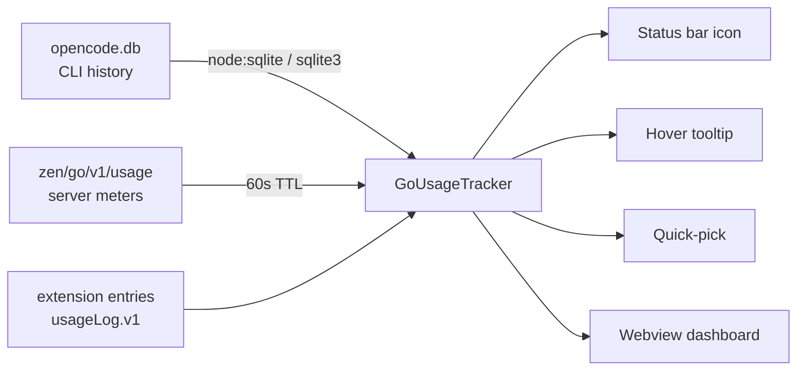

**Status:** 🟢 Active

# Usage Dashboard — Real Data, Realtime, Full-Page Panel

**Topic:** usage / status-bar / webview / dashboard / sqlite / cli / provider
**Updated:** 2026-08-13
**Tags:** #usage #status-bar #webview #dashboard #sqlite #cli #provider #feature
**PR:** [#138](https://github.com/ltmoerdani/opencode-copilot-chat/pull/138) (merge commit `616d6f6`, 2026-08-13)
**Supersedes:** feature doc [`05-20260613-usage-webview-panel.md`](05-20260613-usage-webview-panel.md) (early panel design history)
**Related:** issue doc [`66-20260813-pr138-central-config-utils-usage-dashboard.md`](../issues/66-20260813-pr138-central-config-utils-usage-dashboard.md) · feature doc [`03-20260605-go-usage-tracker.md`](03-20260605-go-usage-tracker.md) · issue doc [`62-20260812-pr132-go-usage-server-sync.md`](../issues/62-20260812-pr132-go-usage-server-sync.md)

---

## Overview

The usage feature is a real-time Go subscription monitor split across the **status bar**, a **hover tooltip**, a **quick-pick**, and a **full-page webview dashboard**. Since PR #138 it reads **real data** (official server meters + OpenCode CLI history + extension-tracked requests), refreshes on a **background cadence**, formats everything in **compact K/M/B/T** units, and renders an interactive dashboard with ring meters and line charts.

This doc is the living reference for the feature as of #138. The early design history (pre-#138 panel) lives in the superseded doc `05-...`.

---

## Data Sources & Flow

| Source                                                                             | What it provides                                                        | Authoritative for                                                          |
| ---------------------------------------------------------------------------------- | ----------------------------------------------------------------------- | -------------------------------------------------------------------------- |
| **OpenCode CLI history** (`~/.local/share/opencode/opencode.db`, per-message rows) | `cost`, `tokens.{input,output,reasoning,cache}`, `path.cwd`, timestamps | Today / Yesterday / Codebase rows (device-local spend + tokens + requests) |
| **Server usage endpoint** (`GET https://opencode.ai/zen/go/v1/usage`)              | Session / Weekly / Monthly `percent` + `resetsAt`                       | Rolling meters (account-wide, server-accurate)                             |
| **Extension-tracked entries** (`opencodego.usageLog.v1`)                           | per-request cost/tokens                                                 | Fallback merge + session costs                                             |

- **Read order for CLI history:** `node:sqlite` (`DatabaseSync`, read-only, retried twice on busy WAL states) → fallback `sqlite3` binary from PATH **plus** known locations (system, Homebrew, Android SDK) → extension-tracked entries only. The zero-usage bug (issue #144) was an Android-SDK `sqlite3` shadowing on desktop-launched VS Code windows; the `node:sqlite` path removes that dependency.
- **Memoization:** the CLI read (a multi-GB file) is memoized for **3 seconds**, so a burst of UI refreshes pays the query cost once.
- **Server meters:** 60s TTL (`GO_USAGE_SYNC_TTL_MS`); failures (401/403/404/network) fall back to the SQLite → tracked estimates. The key is only ever sent as the `Authorization` header, never logged or persisted.

---

## Today / Yesterday / Codebase Rows

- **Today / Yesterday** merge the CLI history with extension-tracked requests. Source selectable via `opencodego.usageTodayYesterdaySource`:
  - `auto` (default) — CLI history merged with extension-tracked requests (best accuracy)
  - `cli` — CLI history only
  - `extension` — extension-tracked requests only
- **Codebase** row (all-time usage for the current workspace) replaces the old "Session (est)" estimate. Matched per-directory from CLI history `path.cwd`, windowed by `opencodego.usageCodebaseWindowDays` (0 = all history). Toggle: `opencodego.usageCodebaseRow` (default `true`).
- **Day boundary:** `opencodego.usageDayBoundary` (`utc` default / `local`) controls where the Today/Yesterday rows roll over.
- **When the CLI history is unavailable** (no `node:sqlite`, no `sqlite3` binary), the Codebase total falls back to everything the extension has tracked (it only ever runs inside the current workspace); the rows builder reports `sqliteAvailable: false` so the UI can show a diagnostic.

### Tracker internals (`src/goUsageTracker.ts`)

| Function                        | Role                                                        |
| ------------------------------- | ----------------------------------------------------------- |
| `readOpenCodeHistory()`         | memoized CLI-history reader (3s TTL)                        |
| `readOpenCodeHistoryUncached()` | `node:sqlite` → `sqlite3` → `null`                          |
| `dailyUsage(rows, dayStartMs)`  | Today/Yesterday cost/requests/tokens from CLI rows          |
| `codebaseUsage(rows)`           | per-directory all-time totals for the workspace             |
| `buildSummaryFromRows(...)`     | full `UsageSummary` from CLI rows + baselines (SQLite path) |
| `buildSummaryFromTracked(...)`  | fallback `UsageSummary` from extension-tracked entries      |
| `dayStartMs(nowMs)`             | UTC or local midnight per `usageDayBoundary`                |
| `getSummary()`                  | unified entry point used by status bar / tooltip / panel    |

---

## Server-Accurate Rolling Meters (PR #132)

The status bar, tooltip, quick-pick and panel show Session / Weekly / Monthly **percent** values computed server-side (rolling 5-hour window, Mon–Mon week, anchor-based month) via `GET /zen/go/v1/usage`. `spent` is derived from the authoritative percent; Today/Yesterday + per-session spend stay device-local. A `60s` TTL reuses a successful snapshot, and the last snapshot is persisted (`opencodego.serverUsage.v1`) so the UI renders real meters immediately on startup instead of zeros while the refetch lands.

---

## Permanent Tracking

- The **"Reset tracked usage data"** action is removed.
- The **31-day entry cutoff** is gone — only the hard **2000-entry cap** (`GO_MAX_LOG_ENTRIES`) applies. Today/Yesterday/Codebase can no longer be deleted or silently expire.
- Session costs are tracked per profile with a 2h idle window (`GO_SESSION_IDLE_MS`) and a 50-session cap (`GO_MAX_SESSIONS`).
- Manual target baselines (`setManualSpentTargets`, persisted in `opencodego.usageBaseline.v1`) support the "Set targets" action; the #138 fix ensures the SQLite path no longer subtracts a baseline that the raw rows never contain (issue #143).

---

## Realtime

- **Background refresh loop:** `opencodego.usageRefreshIntervalSeconds` (default `60`, min `5`). The status bar, tooltip, panel, terminal-side CLI usage, server meters and midnight rollovers all refresh on this cadence without waiting for the next chat request.
- **Immediate repaint** on any usage-view setting change; the refresh interval itself applies live on the next tick.
- **Manual Refresh button** in the panel top-right pushes data in place (the page is never reloaded; the active tab is preserved).

---

## Compact Number Formatting

Shared pure helpers in `src/utils.ts`:

- `formatCount` / `formatTokenCount` — token AND request counts render as `1.2T` / `1.2B` / `1.2M` / `12k` with correct unit escalation at rounding boundaries (no more `1000.0M`).
- `formatUsd` — `$1.23M` / `$1.50K` / `$12.30`, with sub-cent precision (`$0.0004`) so tiny spend never collapses to `$0.00`.
- `formatRelativeTime` — `now` / `5m` / `3h` / `3h 20m` / `2d 4h` (days branch fixed in #138: no more `26h`).

Applied to the status-bar tooltip, hover card, quick-pick and usage panel.

---

## Full-Page Usage Panel (webview)

A persistent webview panel (`ViewColumn.Beside`, `opencodego.usageWebview`) with `enableScripts: true` and a strict CSP (`default-src 'none'; style-src 'unsafe-inline'; script-src 'unsafe-inline'; img-src data:`). All model names inserted into the DOM are HTML-escaped (`esc()` / `escapeHtml`).

**Layout:**

- **Animated ring meters** — Session / Weekly / Monthly subscription percent.
- **Stat chips** — Today / Yesterday / Codebase.
- **Chart area** with tabs:
  - **Spend / Requests / Tokens** — line charts with whole-chart hover: hovering anywhere highlights the nearest day (guide line + dots) with a cursor-follow tooltip.
  - **Models** — overlapping colored per-model daily-spend lines, ranked legend, per-day tooltips listing every model's spend.
  - **Suggested / Approved** — per-day inline chat-completion counters (whole-number axes, honest tooltips; both series share identical day buckets so hovers never resolve to undefined).
- **Window toggle** — Week → 14 days → Month → Lifetime (default **Lifetime**; also `opencodego.usageChartDays`, 0 = lifetime).
- **Action buttons** (top-right) — **Set targets**, **Rename** (when multiple profiles exist), **Refresh** — wired via `vscode.postMessage`.
- **Axes** use round equal tick steps (1/2/2.5/5 × 10ⁿ) so gaps stay equal and clean.

### Completion counters (Suggested / Approved)

- Persisted per-day in globalState (`opencodego.completionUsage.v1`, retained `COMPLETION_USAGE_MAX_DAYS` = 370 days).
- **Suggested** = suggestions shown by the inline-completion provider.
- **Approved** = acceptances detected via a bounded insert heuristic (`matchesAcceptance`): VS Code's stable API exposes no inline-completion acceptance event, so committing a ghost text is recognized by the document insert starting exactly at the suggested position with matching multi-character text (30s window, cleared on first match).

---

## Settings (all under `opencodego.`)

| Setting                       | Default | Notes                                           |
| ----------------------------- | ------- | ----------------------------------------------- |
| `usageTodayYesterdaySource`   | `auto`  | `auto` / `cli` / `extension`                    |
| `usageCodebaseRow`            | `true`  | show the all-time workspace row                 |
| `usageCodebaseWindowDays`     | `0`     | 0 = all history                                 |
| `usageRollingSessionMeter`    | `true`  | hide server 5-hour meter in detailed views      |
| `usageDayBoundary`            | `utc`   | `utc` / `local` midnight for Today/Yesterday    |
| `usageRefreshIntervalSeconds` | `60`    | min `5`                                         |
| `usageChartDays`              | `0`     | 0 = lifetime (panel Window button toggles live) |
| `showUsageStatusBar`          | `true`  | master status-bar switch                        |

---

## Known Limitations

- **Inline-completion cost attribution is a follow-up.** Completion requests are not yet wired into `tracker.record()` (USD cost of completions not attributed); only per-day Suggested/Approved counts are tracked. Tracked as a documented TODO on #136/#138.

---

## Verification

- 276 unit tests green (grown from 207 at the #136 merge base), strict lint + tsc + prettier + markdownlint green, VSIX packages and installs cleanly.
- Maintainer independently re-ran compile + suite on the final head before merge.

---

## Related

- Issue doc [`66-20260813-pr138-central-config-utils-usage-dashboard.md`](../issues/66-20260813-pr138-central-config-utils-usage-dashboard.md) — PR #138 timeline, bug list (#139–#148), review cycle.
- Issue doc [`62-20260812-pr132-go-usage-server-sync.md`](../issues/62-20260812-pr132-go-usage-server-sync.md) — the server meters feature (PR #132).
- Feature doc [`03-20260605-go-usage-tracker.md`](03-20260605-go-usage-tracker.md) — tracker design history (local estimates → SQLite → server sync).
- Feature doc [`05-20260613-usage-webview-panel.md`](05-20260613-usage-webview-panel.md) — early panel design (superseded).
- Feature doc [`15-20260813-inline-code-suggestions.md`](15-20260813-inline-code-suggestions.md) — the autocomplete feature feeding the Suggested/Approved tabs.
